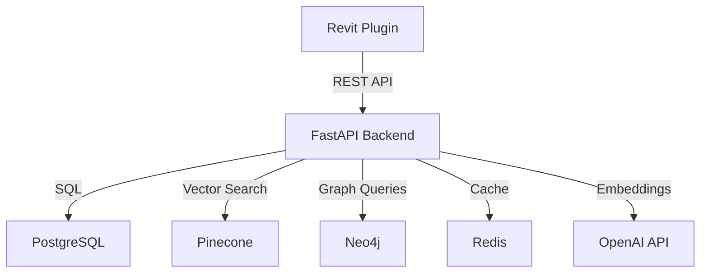

# System Architecture

## Overview

Projektant Copilot is a distributed system consisting of three main components:

1. **Revit Plugin** (Client) - C# application running inside Autodesk Revit
2. **Backend API** (Server) - Python FastAPI application
3. **Data Layer** - PostgreSQL, Pinecone, Neo4j, Redis

## Component Diagram



## Data Flow

### Real-Time Compliance Check

```
1. User modifies wall in Revit
   ↓
2. IUpdater detects modification
   ↓
3. ContextExtractor extracts element properties
   ↓
4. ApiClient sends POST /api/v1/compliance/check
   ↓
5. Backend generates query embedding
   ↓
6. Pinecone vector similarity search
   ↓
7. Filter by metadata (building type, element type)
   ↓
8. Return top-k relevant rules
   ↓
9. Compliance engine evaluates violations
   ↓
10. Response sent to plugin
    ↓
11. UI displays notification to user
```

## Database Schema

### PostgreSQL

**users**
- id, email, hashed_password, full_name, is_active, created_at

**projects**
- id, user_id, name, building_type, location, revit_version

**compliance_rules**
- id, rule_id, rule_type, geometry_type, building_types, value_mm

**compliance_checks**
- id, project_id, element_id, is_compliant, checked_at

**check_results**
- id, check_id, rule_id, severity, message, confidence_score

### Pinecone

**Index: csn-building-codes**
- Dimension: 1536 (OpenAI ada-002)
- Metric: Cosine similarity
- Metadata: rule_id, geometry_type, building_types, language

### Neo4j

**Nodes**: Building, Floor, Room, Wall, Door, Window

**Relationships**: CONTAINS, CONNECTS_TO, ADJACENT_TO, PART_OF

## API Architecture

### RESTful Endpoints

```
GET  /health                    - Health check
GET  /api/v1/health/detailed    - Detailed health check
POST /api/v1/compliance/check   - Check element compliance
GET  /api/v1/compliance/rules   - List available rules
POST /api/v1/ingest/document    - Ingest building code PDF
```

## Security

- JWT token authentication
- HTTPS in production
- Environment variable secrets
- Input validation (Pydantic)
- SQL injection prevention (SQLAlchemy)
- CORS configuration

## Scalability Considerations

- Async database operations
- Connection pooling
- Redis caching layer
- Horizontal scaling via load balancer
- Database read replicas for queries
- CDN for static assets

## Performance Targets

- API response time: <100ms (p95)
- Vector search: <50ms
- Throughput: 1000 requests/minute
- Cache hit rate: >70%
